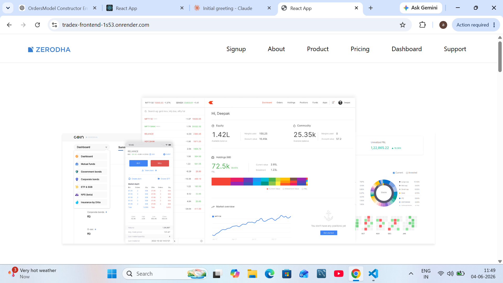
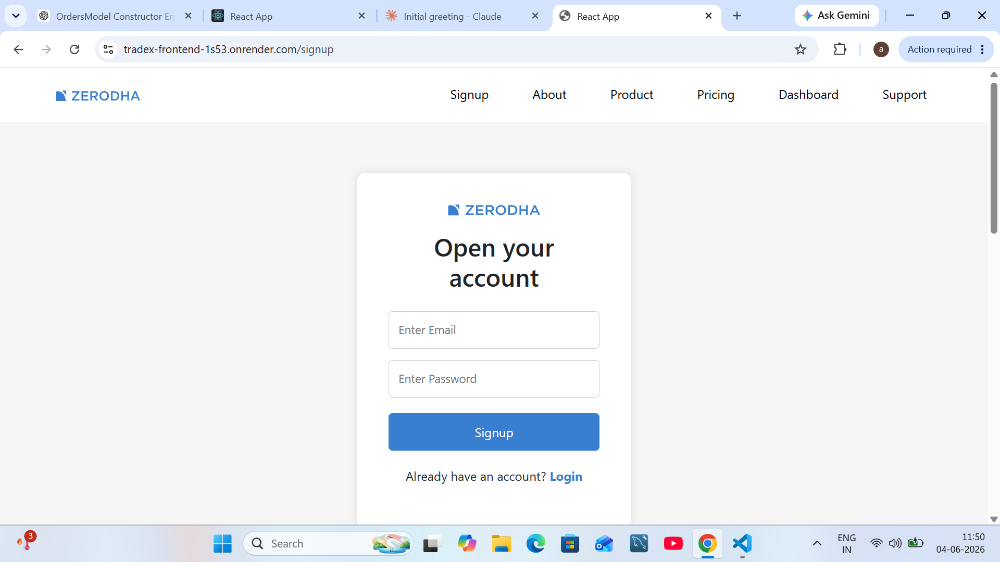
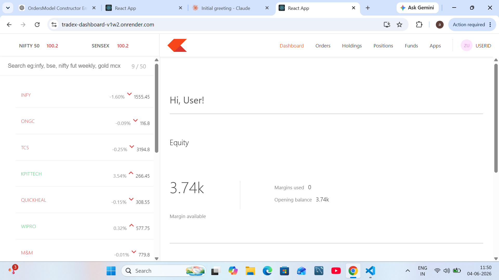
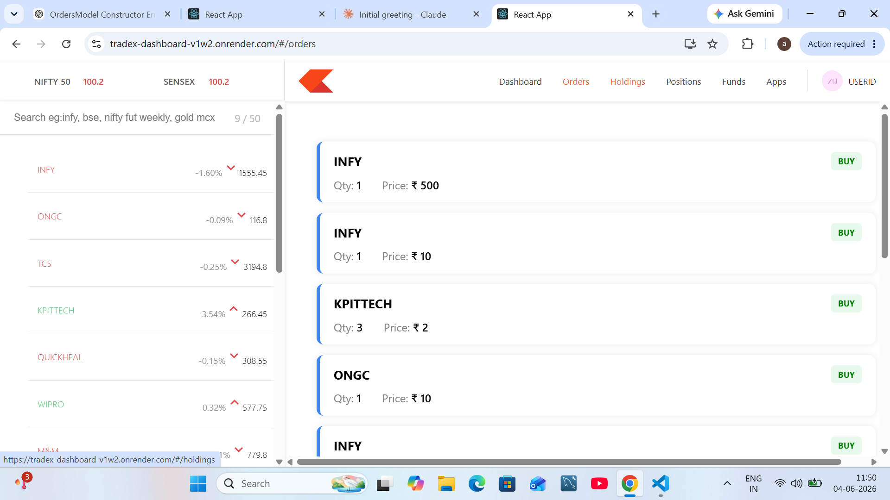
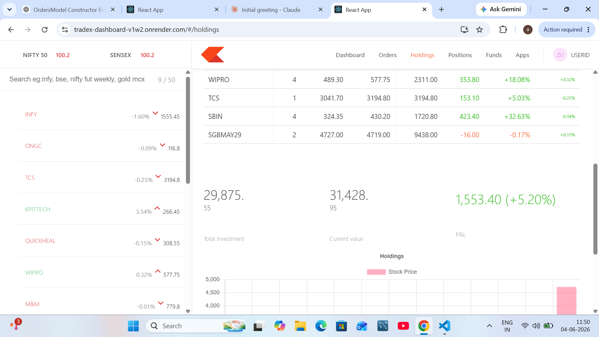

# TradeX 🚀

A full-stack stock trading platform inspired by Zerodha, built using React.js, Node.js, Express.js, and MongoDB.

## Live Demo

### Frontend
[Live Frontend](https://tradex-frontend-1s53.onrender.com)

### Dashboard
[Live Dashboard](https://tradex-dashboard-v1w2.onrender.com)

### Backend API
[Backend API](https://tradex-u12x.onrender.com)

## Features

* Modern Zerodha-inspired UI
* Interactive Trading Dashboard
* Holdings Management
* Orders Management
* Positions Tracking
* Funds Section
* Buy & Sell Stocks
* MongoDB Integration

## Tech Stack

### Frontend

* React.js
* React Router
* Material UI
* Chart.js

### Backend

* Node.js
* Express.js
* MongoDB
* Mongoose

## Project Structure

TradeX/
├── frontend/
├── dashboard/
└── backend/

## Future Improvements

* JWT Authentication
* User Portfolio Management
* Real-time Market Data
* Advanced Analytics
* Watchlist Persistence
* Responsiveness

## Home Page

## Login Page

## Dashboard

## Orders

## Holdings

## Author

Abhishek Kumar
